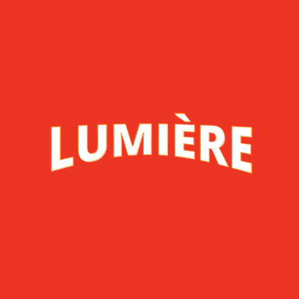

  

# Lumière - Illuminate Your Entertainment Universe 🌟

Step into the dazzling world of Lumière, where entertainment knows no bounds! This project showcases a cutting-edge landing page for a next-gen streaming platform that pushes the boundaries of user experience.

## 🚀 Features That Shine

- **Responsive Magic**: Seamlessly adapts to any device, from smartphones to 4K displays
- **Interactive FAQ Wonderland**: Engage users with smooth, accordion-style Q&As
- **Smart Email Validation**: Keep user data pristine with intelligent form checking
- **Globe-Trotting Language Picker**: Cater to a worldwide audience with style
- **Cinematic Feature Showcases**: Bring content to life with integrated video sections
- **Sleek, Custom UI Elements**: Buttons and inputs that beg to be clicked

## 💻 Technologies Woven Into Our Fabric

- HTML5's semantic richness
- CSS3's styling sorcery
- JavaScript's dynamic capabilities
- Font Awesome's iconic visual language
- Google Fonts' typographic elegance

## 🎨 Skills Illuminated

- **Pixel-Perfect Responsive Craftsmanship**: Flexbox mastery for flawless layouts
- **JavaScript Wizardry**: DOM manipulation and event handling par excellence
- **CSS Artistry**: Animations and transitions that captivate
- **Accessibility Advocacy**: Ensuring entertainment for all
- **Performance Optimization**: Lightning-fast load times
- **Cross-Browser Harmony**: Consistent experience across all platforms

## 🌈 Dive Into the Lumière Experience

1. Clone this cosmic repository
2. Launch `index.html` in your browser of choice
3. Prepare to be dazzled!

## 🤝 Join the Lumière Revolution

Got ideas to make Lumière shine even brighter? Contributions, issues, and feature requests are not just welcome – they're celebrated!
